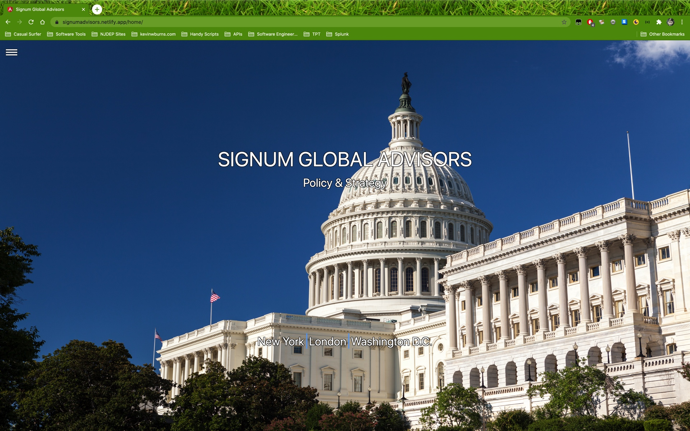

# Signum Global Advisors Demo
This is a demo app for Signum Global Advisory. The client, Signum Global Advisory required a full stack web application. The application has a mobile first layout design.
The program also has a file directory, integrating a file management system for the firm's IT and marketing department. 

<p align="center">

</p>

## Installation
You could clone the repo or click the download button. 

```bash
$ git clone https://github.com/kevintage83/signumDemo
```

## Usage (Windows)
```bash
cmd /c start signumDemo
```

## Usage (MacOS X)
```bash
open signumDemo
```

## Usage (Linux/Unix)
```bash
xdg-open signumDemo
```

## Contributing
I am currently not handling pull requests for this application. The repo is mainly serves as a conversation piece for developers. 

I would also ask that you please make sure to update tests as appropriate.

## License
[MIT](https://choosealicense.com/licenses/mit/)
